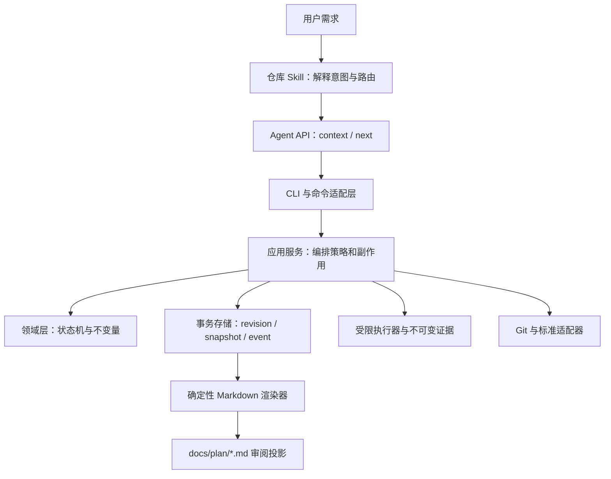
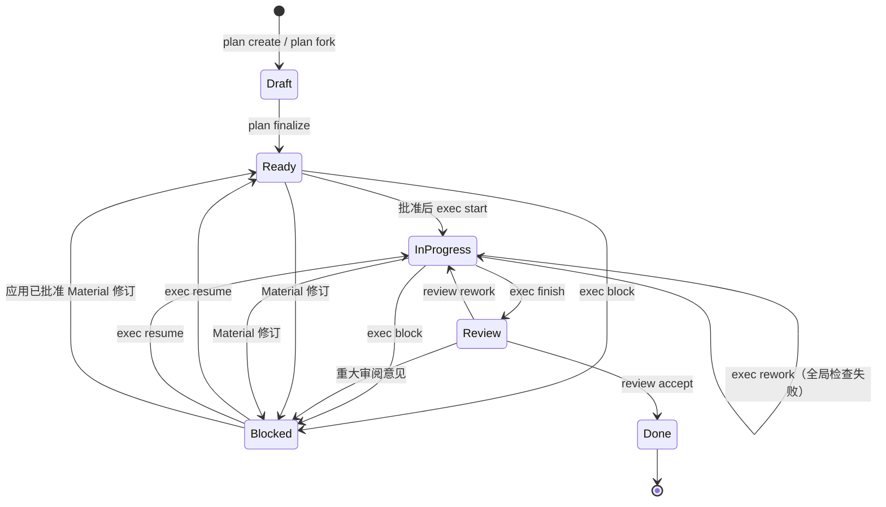

# Mino 架构

本文解释 Mino 的系统边界、状态所有权和恢复模型。命令参数与 JSON 字段请查阅[CLI 与 JSON 契约](command-contract.md)，具体风险处置请查阅[安全与操作边界](security.md)。

## 设计出发点

Mino 把“意图解释”和“协议执行”分开：编码代理可以用概率性推理理解需求，但所有状态转换、审批条件、执行顺序和证据绑定都由确定性代码决定。

这项分工带来四条架构原则：

1. **规范状态只有一个来源**：`.mino/` 中的 JSON、快照和事件是事实，Markdown 是投影。
2. **修改必须可并发校验和幂等重放**：每次语义修改绑定 revision 与 request ID。
3. **副作用必须有窄边界**：进程、Git、网络和文件写入分别由专门适配器约束。
4. **审批不可继承或猜测**：计划批准、分支创建、重大修订和最终验收等边界互不替代。

## 系统分层



| 层级 | 负责 | 不负责 |
|---|---|---|
| 仓库 `AGENTS.md` | 稳定触发规则、仓库硬约束、外部工具与 Git 授权 | 动态计划状态、完整执行算法 |
| Mino Skill | 意图路由、CLI 编排、识别审批停止点 | 改写规范状态、伪造模板或绕过 CLI |
| CLI 与 `commands` | 参数解析、命令分发、稳定输出格式 | 推断需求、隐藏审批 |
| `application` | 协调领域、存储、投影、执行和 Git 策略 | 定义新的领域状态 |
| `domain` | 计划、任务、检查、证据和审阅的合法状态及转换 | 文件系统、网络、进程和 Git 副作用 |
| `store` | 锁、规范序列化、事务恢复、快照和事件审计 | 业务意图判断 |
| `runner` / `evidence` | 有界进程、脱敏、运行日志和不可变证据 | 任意 shell 执行、替用户判断检查意义 |
| `git` | 只读事实、工作树身份、受控分支和精确任务提交 | 远程或破坏性 Git 操作 |
| `standards` | 内嵌规则、检测、推荐、冲突和显式同步 | 通用依赖安装或远程代码执行 |

## 项目发现与初始化

读取型命令按以下顺序寻找项目根：

1. 通过五秒、64 KiB 的统一 Git probe profile 运行 `git rev-parse --show-toplevel`。
2. 向上查找最近的 `.mino/`。
3. 向上查找最近的受支持清单：`Cargo.toml`、`package.json`、`pyproject.toml`、`setup.py`、`go.mod`、`pom.xml`、`build.gradle` 或 `build.gradle.kts`。

Git 明确报告非仓库时继续查找文件系统标记；Git 不可用、超时或输出异常时也允许已存在的 `.mino` 或清单成为确定性 fallback，但在没有任何文件系统证据时保留类型化 Git 失败。只有 `project init` 可以在以上规则均失败时使用调用方指定的目录。初始化会验证内嵌协议、创建缺失的 `.mino` 状态，并在分类 Skill、`AGENTS.md` 或 `.gitignore` 前恢复可证明安全的集成替换事务；除非显式提供 apply 参数，它不会发起新的 `AGENTS.md` 或 `.gitignore` 修改。初始化本身不执行网络或 Git 修改。

项目扫描通过串行且按路径排序的 `ignore::WalkBuilder` 读取根目录和嵌套 `.gitignore`、`.git/info/exclude` 以及 Git 全局 exclude；hidden filter 被关闭以保留 `.github` 等配置，符号链接不会被跟随。默认预算为最大深度 64、最多访问 100,000 个普通文件、总内容读取 128 MiB、单文件读取 4 MiB；内容读取使用固定 64 KiB 缓冲。预算触发后返回确定性的部分证据，并在 `bytes_read`、`truncated` 和排序后的 `truncation_reasons` 中显式说明，不把部分结果表示为完整扫描。

旧计划导入复用同一套计划服务，但采用两阶段写入：先读取完整且有界的源文件，预览可映射字段并产生警告；随后创建 revision 1 的 Draft，再以派生 request ID 写入 revision 2。中断后的精确重试可以补完第二阶段，历史状态、审批和证据不会被当作可信事实。

## 规范数据布局

```text
<root>/
├── .agents/skills/mino/                 可跟踪的仓库 Skill
├── .mino/
│   ├── config.toml                      项目格式与可选目录 URL
│   ├── protocol.lock                    协议、schema 与渲染器锁
│   ├── standards.local.toml             可选的本地标准来源声明
│   ├── standards.lock                   已选择标准与目录 generation
│   ├── authority.json                   AGENTS planning authority decision 与摘要
│   ├── authority.lock                   authority mutation 写入锁
│   ├── plan-selection.json              项目级 selected plan 与 alternatives
│   ├── plan-selection.lock              方案选择写入锁
│   ├── active.json                      按工作树保存的 Git 身份绑定
│   ├── active.lock                      绑定写入锁
│   ├── integration-transactions.lock    集成替换全局锁
│   ├── integration-transactions/<hash>/ prepared/backed_up/published/cleaned 记录
│   ├── git/
│   │   ├── branch.lock                  分支操作锁
│   │   ├── commit.lock                  任务提交操作锁
│   │   ├── branches/<plan-id>/
│   │   │   ├── intent.json              审批绑定的不可变分支意图
│   │   │   └── completion.json          不可变终态结果
│   │   └── commits/<plan-id>/<task-id>/
│   │       ├── intent.json              写索引前的内容快照
│   │       ├── staged.json              已暂存 tree 身份
│   │       └── completion.json          提交、证据与计划结果
│   ├── cache/standards/                 已验证的不可变同步 generation
│   └── plans/<plan-id>/
│       ├── plan.json                    当前规范聚合
│       ├── events.jsonl                 追加式成功事件
│       ├── snapshots/<revision>.json    不可变 revision 快照
│       ├── store.lock                   有界计划锁
│       ├── transaction/                 尚待恢复的预备事务
│       ├── runs/<request-id>/            owner.lock、检查 lease 与结果
│       ├── monitors/<request-id>/summary.json
│       └── evidence/
│           ├── index.jsonl              不可变证据索引
│           ├── records/                 规范证据记录
│           └── blobs/                   按内容寻址的附件
└── docs/plan/<plan-id>.md                人工审阅投影
```

文档契约中使用的完整监控路径为 `.mino/plans/<plan-id>/monitors/<request-id>/summary.json`。

### 路径所有权

| 路径 | 所有者与修改方式 |
|---|---|
| `.mino/config.toml` | Mino 项目配置；只通过受支持的配置流程修改。 |
| `.mino/protocol.lock` | 协议锁；禁止手工改写以伪造兼容状态。 |
| `.mino/standards.local.toml` | 用户审阅的可选输入；Mino 读取但不生成。 |
| `.mino/standards.lock` | 标准选择锁；显式同步可以原子替换。 |
| `.mino/authority.json` | 绑定完整 `AGENTS.md` 摘要的 Durable planning authority detection、decision 与审计；只通过 `project authority decide/apply` 修改。 |
| `.mino/plan-selection.json` | 项目级方案选择；由 create/fork/archive 维护候选，只通过 `mino plan select` 改变显式选择。 |
| `.mino/active.json` | Git 工作树身份绑定；只通过 `mino git bind` 修改，不负责选择活动方案。 |
| `.mino/integration-transactions/` | Skill 与 marker-owned 文件替换的规范恢复记录；只由 `project init` 恢复。 |
| `.mino/git/branches/` | 分支意图与完成日志；禁止手工编辑。 |
| `.mino/git/commits/` | 任务提交日志；禁止手工编辑。 |
| `.mino/plans/` | 计划、历史、运行与证据的规范存储；禁止手工编辑。 |
| `docs/plan/` | 自动生成的审阅投影；禁止手工编辑。 |
| `.agents/skills/mino/` | 稳定仓库 Skill；仅 marker-owned 文件可由 Mino 更新。 |
| `AGENTS.md` | 用户所有，只有精确的 Mino marker 区域受管。 |
| `.gitignore` | 用户所有，只有精确的 Mino runtime marker 区域受管。 |

受管 `.gitignore` 区块忽略 `/.mino/` 和 `/docs/plan/`。Skill 不被忽略，因为它需要像其他稳定仓库指令一样接受审阅和版本控制。

集成文件替换在目标父目录保存摘要绑定的 temporary/backup，并在 `.mino/integration-transactions/<target-hash>/` 追加不可变的 `prepared -> backed_up -> published -> cleaned` phase record。每个 phase 都绑定 target、backup、temporary、原摘要和替换摘要。`project init` 在任何集成分类前持锁恢复：prepared 可以回滚到原文件，backed_up 可以恢复原文件或继续发布，published 只清理摘要匹配的残留，cleaned 只移除事务记录。任何未知路径、非连续 phase、非规范 JSON 或摘要外字节都会保留并报错。`project doctor` 只读报告 pending/corrupt，不执行恢复。

`AGENTS.md` 仍由用户拥有。Mino 对完整普通文件做 1 MiB bounded read，以 fenced-aware scanner 检测 active legacy Durable planning clauses，再把 source digest、clause lines、decision、actor/reference/time 和成功 rewrite digest 保存到 `.mino/authority.json`。pending/stale dual authority 与 declined decision 都阻止新的 Durable plan；coexistence-approved 让 Mino 拥有 Durable workflow 而不改源文件；superseded 只在 digest-bound guarded transaction 已发布精确 replacement 后成立。source byte 改变会使 terminal decision stale；canonical `project.init` refresh 增加 authority revision、重新绑定 detection 并回到 pending，不继承旧 approval。rewrite 复用 integration transaction recovery，仅替换一个确定的 `Planning Documents` section；任何 source drift、symlink、非普通文件或异常 journal 都保留现场并 fail closed。

### 受管读取预算

受管状态不再提供无界整文件读取入口。固定大小文件在解析前按类型拒绝超限字节；追加日志逐条流式读取，不先分配整个日志：

| 状态类型 | 上限 |
|---|---:|
| config、protocol/standards lock、planning authority、AGENTS authority source、plan selection、active binding、branch journal、integration phase、standards source/cache document | 1 MiB |
| 当前计划、snapshot、计划事务 | 8 MiB |
| 单条 plan event（含 LF） | 1 MiB |
| run lease/result、commit journal、monitor summary、单条 evidence record/index entry | 4 MiB |
| Markdown projection、evidence blob、integration target/backup/temporary | 16 MiB |

计划 `events.jsonl` 和 evidence `index.jsonl` 的生命周期总长度不设人为整文件上限，但每条记录分别限制为 1 MiB 和 4 MiB。恰好达到上限的文件或记录可读，多一个字节即在 JSON/TOML 解析前产生类型化 drift/corruption。Workspace fingerprint 另以单文件 16 MiB、一次 capture 总计 256 MiB 为内容预算。

## 计划生命周期



`plan finalize` 会把所有 Draft 任务转为 Ready。执行阶段只有第一个依赖满足的任务可以启动，并且任何更早的必需任务提交都必须已经记录。一个任务只有在以下门槛全部满足时才能进入 Done：

- 计划检查已通过；
- 每项验收条件绑定兼容且仍有效的证据；
- 必需检查点已记录；
- 没有未解决偏差；
- 相对于 task-start baseline 的当前任务增量符合 File Map。

计划的 `extensions.git_readiness_state` 是 versioned typed state，统一拥有 repository mode、canonical worktree/common directory、branch、完整 HEAD、规范 status digest、clean flag、observation timestamp，以及 setup 和 pre-plan cleanup 决策。create/fork 捕获初始 observation：缺少 repository 形成 Pending setup，dirty tree 形成 Pending cleanup，clean worktree 形成 NotRequired；Git Flow eligibility 由该完整状态确定，不通过一个静默布尔值替代未完成决定。

setup 的终态选择和每项 cleanup approval 都保存 actor、decision reference 与 timestamp。cleanup proposal 使用稳定有序的 `C<n>`，其互斥文件集合必须恰好覆盖观察到的 dirty paths；record 只核对外部已创建 commit 的 current HEAD、parent、完整 OID、单行 Conventional Commit message、exact files 与顺序，不运行 Git mutation。所有项目记录完毕且 live tree clean 后，refresh 才把 cleanup 转为 Completed。unsafe/unmerged/submodule 状态或 pre-plan path 与任务 File Map 重叠会使 Draft/Ready 进入带原恢复状态的可恢复 Blocked；完成外部修复和 refresh 后解除。

finalize、review、approve、exec start 和 branch create 都只读重采样并比较，发现漂移时返回显式 revisioned refresh action。refresh 是唯一更新 observation 的路径；Ready refresh 会撤销旧 plan approval、Git Flow consent 与 workspace baseline。commit preflight 只比较 repository identity 和 branch，允许实现任务产生 dirt，同时继续由 commit gate 核对 parent、index、scope 和文件对象身份。

计划批准时捕获 `PlanBaseline`，每次 `exec start` 捕获对应 `TaskBaseline`。两者在 Git 与非 Git 项目中都保存 path、存在性、对象类型、长度、可执行位和内容摘要；Git 模式另保存 HEAD、index tree 与 status。任务完成计算 `current workspace - task-start baseline`，因此批准前的未变脏文件和前一未提交任务的变化不会被错误归给当前任务，而当前任务对同一路径的进一步修改仍会被识别。

<!-- doc-contract: final-plan-delta-gate -->

最终范围不是由最后一次全局检查的 fingerprint 隐式推断。`exec finish`、`review resolve` 和 `review accept` 都在任何状态写入前执行同一个 Final Plan Delta gate：文件系统侧比较当前项目与 approved `PlanBaseline`，Git 侧另比较 baseline HEAD 到 current HEAD 的完整 tree delta，从而同时覆盖未提交、已提交和非 Git 变化。授权集合是所有任务 File Map 按 `Create`/`Modify`/`Delete`/`Test` 语义形成的并集，加上 `Resolved Minor` 偏差中逐条精确记录的路径；`.git/**`、`.mino/**` 和当前受管 projection 明确排除。任一其他路径以稳定排序的 `out_of_scope_paths` 阻止 finish、resolve 或 accept。

required commit gate 的合法终态是 `Committed`、`Not Required` 或带审批证据的 `Skipped`。全局必需检查失败后，`exec rework` 可以重新打开一个 Done 任务并重置该任务的验收、检查、commit gate、task baseline 和全部全局检查；除此之外不能任意回退任务。`exec finish` 还要求所有任务提交门槛、全局检查和 Final Outcome 完成，然后把计划送入 Review。归档不属于生命周期状态；它是保留全部历史的停用 overlay。

## 审阅、修订与方案分支

审阅记录是追加式的，并按行为分为四类：

- **Acceptance Defect**：重新打开已完成任务，只允许补充新的验收与检查证据，不允许改文件。
- **In-Scope Rework**：在记录反馈时预留递增 `R<n>`，提供完整任务定义后进入执行顺序。
- **Material Change**：把计划置为由审阅流程拥有的 Blocked，普通 `exec resume` 无法绕过。
- **Follow-Up**：记录为 Deferred，不进入当前任务顺序。

受保护修订使用递增 `C<n>` 和类型化操作。`Minor` 仅允许任务局部、不会改变用户可见行为的调整；如果新增 File Map 路径需要当前未选择的 Rust、Python 或 TypeScript/JavaScript 标准包，最低分类自动提升为 `Material`。Material 操作可以新增、更新或删除任务、验收条件、任务/全局检查和 commit gate，也可以替换任务依赖、定义及顺序；候选图会在 clone 上完整校验后原子应用。`Material` 会清除计划批准和 Git Flow consent、重置任务与检查门槛、使相关证据失效，并要求重新校验与批准。尚未 apply 的修订可进入 `Rejected`、`Withdrawn` 或 `Cancelled` 终态；这些出口只保存决定，不应用 patch。

偏差是带稳定 `D<n>` 的独立实体。只有 `Open` 阻塞完成；`Resolved` 绑定当前任务的有效 evidence，`Rejected` 绑定人工 decision reference，`Superseded` 绑定已 Applied amendment。旧版 Deviation checkpoint 在读取时确定性映射为带 legacy link 的偏差。

Material review 先进入 review-owned Blocked，再由 `accept-change`、`decline` 或 `defer-to-follow-up` 明确处置。接受变更仍须走与该 Review item 双向关联的 Material amendment；拒绝会解决该项；延后会把带 Review ID 来源的任务同步到 Final Outcome。每次处置写入追加式 decision history。若 Accept Change 关联的 amendment 最终为 `Rejected`、`Withdrawn` 或 `Cancelled` 且从未应用，`review disposition revise` 可在新的显式审批引用下改为 Decline 或 Defer；旧决定和终止 amendment 均保留，不能覆盖历史或再次写 Accept Change。任何返工或 Material apply 都使旧 Final Outcome 失效。

`plan fork` 从经过完整审计的历史快照创建独立 revision 1 Draft。它复制需求、范围、决策、标准、任务、检查和提交意图，但清除生命周期、审批、证据、审阅结果、执行扩展、Git 就绪状态及归档状态。lineage 保存来源计划、revision、原因、快照哈希和时间。

`plan diff` 只比较规范化后的 authored values，不修改或合并输入。`plan archive` 追加停用记录但不删除计划。计划 fork 与 Git branch 是两套独立概念，Mino 不提供 plan merge。

普通计划创建和 legacy import 都遵守“每个项目至多一个活动计划候选集”的项目级约束；只有显式 `plan fork` 可以增加并存 alternative。`.mino/plan-selection.json` 以独立 selection revision 保存 selected plan、稳定排序的 alternatives 和最后一次选择审计。没有该文件的旧项目以虚拟 revision 0 解析：一个 live plan 被虚拟选中，多个 live plan 保持未选择并要求审批绑定的 `plan select`。Git binding 只保存 worktree identity，不选择、切换或隐藏项目方案；即使 binding 变为 stale，selected plan 仍保持不变，Git 风险通过独立的 binding status 报告。

计划显示名称完整保留 UTF-8。ID 仍为 ASCII：名称含 ASCII 字母或数字时沿用原有最长 96 字符 slug；纯非 ASCII/标点名称使用原始 UTF-8 名称 SHA-256 的前 8 个小写十六进制字符，形成 `YYYY-MM-DD-plan-<8hex>`。相同名称和日期确定性生成同一 ID，不同名称仍受正常 ID collision 检查。

## Revision、事务与投影一致性

每项语义修改携带期望 revision、request UUID、actor、规范命令和变更字段。存储层在每个计划的有界锁内执行以下流程：

1. 检查 revision 与 request ID 幂等性。
2. 生成规范 next state、快照、事件和 write-ahead journal。
3. 依次发布不可变快照、追加式事件和当前 `plan.json`。
4. 返回包含 revision、事件序号和摘要的 receipt。

加载计划时会先完成可证明安全的预备事务，否则报告损坏。相同输入和 request ID 的重试返回原结果，不增加 revision；同一 request ID 携带不同输入则是 revision conflict。

Markdown 投影包含 plan ID、revision、状态哈希和 renderer version。读取与修改服务都会重新渲染并比较字节：缺失投影可以从规范状态恢复，已知旧投影可在合法修改中升级，无法识别的手工编辑会产生 exit 8，并保持原字节不被覆盖。

## 执行与证据

`exec check run` 是三阶段操作：

1. 按 task File Map 或完整 global change scope 捕获 `WorkspaceFingerprint`，并在计划中提交 `Running` lease。
2. 以精确 argv、有限环境、超时和输出上限启动进程，保存运行结果并创建不可变证据。
3. 把证据 ID 和终态检查状态附加到新的计划 revision。

每个派生 run request ID 使用跨进程 `owner.lock`。owner 从发布 lease 前一直持有锁到 terminal result 完成文件与父目录同步；实时精确重试看到锁被占用时立即返回可重试的 AlreadyRunning，不写 result、evidence 或 plan 终态。只有调用方成功取得空闲 owner lock，并在锁内再次确认 lease 存在而 result 缺失，才能证明旧 owner 已退出并恢复不可变的 interrupted 结果。失败证据会保留用于审计，但不能证明验收通过；被 supersede 或被修订标记为 stale 的证据也不能满足当前门槛。

fingerprint 绑定 repository mode、HEAD、index tree、规范化 status entries、task/global scope、每个路径的类型/长度/可执行位/SHA-256，以及完整 canonical digest。显式 File Map 目录或 glob 会额外以关闭标准 ignore filter 的 walker 展开，因此 `.gitignore` 不能隐藏被计划明确授权的 ignored 文件；`.git/**`、`.mino/**`、受管 projection、symlink escape、不安全对象和资源超限仍被拒绝。

<!-- doc-contract: explicit-file-map-overrides-ignore -->
<!-- doc-contract: expected-git-entry -->

Git 模式下，每个 regular-file snapshot 还保存按当前 attributes/index 语义经只读 `git hash-object` 计算的 `expected_git_entry { blob_oid, mode }`，raw SHA-256 仍独立保留。lease、terminal result 和 Command evidence 保存同一份身份。`exec criterion pass`、`exec complete`、自动或人工 commit、`exec finish`、review resolve 与 review accept 都会重新捕获原 scope；任一文件字节、对象类型、模式或适用 Git 身份发生变化，相关 Passed check 会先持久化为 `Stale`，旧 evidence 不再满足门槛，必须重新运行。提交前后的 staged tree/commit tree 以及人工提交的 current HEAD 都必须逐路径匹配 expected blob OID 与 `100644`/`100755` mode；删除路径必须在 tree 中缺失。自动与人工提交都拒绝 active clean filter。global fingerprint 始终绑定最终完整状态。

`exec check monitor` 复用同一检查流程，在前台执行有限重试。最大次数、间隔和总 deadline 一起决定每次进程预算；取消文件、deadline、通过或尝试耗尽都会产生 request-hash-bound 的 `mino.monitor/v1` 终态摘要。精确重试先读取摘要，不再睡眠或启动进程。

`exec schedule spec` 只读取并验证当前计划、同 revision 快照、投影和检查资格，然后生成 `mino.scheduled-task-spec/v1`。它描述执行环境、触发与过期时间、有限重试、结果策略和安全目标路径，但不调用调度器、不访问网络，也不写 Mino 状态。

## 工作树与 Git 边界

`mino git inspect` 通过唯一的生产 Git command adapter 执行窄范围命令，解析 NUL 分隔的 porcelain v2，并显式报告普通、unborn、detached、bare、linked worktree 和非仓库状态。项目发现、计划 readiness、File Map 检查、分支、提交与 hooks 共用该入口；其他生产模块不直接构造 Git 子进程。adapter 清空环境后恢复跨平台基础 allowlist，并按普通操作或短 probe profile 施加 stdin、timeout、合并输出与进程树边界。

`git setup decide`、`git cleanup propose/approve/record` 只改变 plan aggregate 和受管 projection。它们没有调用 Git mutation adapter 的路径；repository 初始化、staging 和 cleanup commits 必须由受 Mino 之外授权的调用方完成，再由 readiness refresh 或 cleanup record 核验结果。

`mino git bind` 以 canonical common directory 和 worktree root 为键保存 Git 授权身份。分支绑定允许该分支向前移动；detached binding 要求完全相同的 HEAD。切换分支或 HEAD 后会变为 `stale_branch` 或 `stale_head`，其他工作树的绑定为 `foreign_worktree`。这些状态会阻止需要当前 Git 身份的操作，但不会改变 `.mino/plan-selection.json` 中的 selected plan。

Agent 编排把该门禁显式化：Approved Git Flow 的 Ready 计划若 binding 不是 current，`next_actions` 先返回精确 `git bind --plan <id> --current`，刷新 context 后才返回 `exec start`；Done task 的自动提交也在同样检查后才返回 `git commit`。每个 `next_actions[].id` 都必须同时存在于 `allowed_actions`，调用方无需也不得插入未返回的状态修改命令。

分支和提交都使用不可变 intent → 外部操作 → completion 三段日志：

- `git branch create` 在单独批准后，只能从捕获的 base 创建并切换到确定名称 `mino/<plan-id>`；切换时禁用仓库 hooks。
- `git commit` 只处理第一个符合条件且要求提交的 Done 任务，要求当前审批、Approved Git Flow、相同工作树绑定、精确父 HEAD、有效证据，以及 File Map 与 Commit Scope 的交集路径。
- `git commit record-manual` 不修改 Git，只验证当前 HEAD 的 object、parent、branch、消息、范围和 fingerprint snapshots，再记录 Commit evidence。
- `git gate skip` 在独立审批引用下记录 AcceptedException evidence，并把 required gate 置为 `Skipped`。
- 提交前索引必须为空；Mino 只暂存解析后的精确路径，并保留正常 commit hooks。失败后不会 reset、unstage 或掩盖现场。

建议型 hooks 采用独立的 propose/status/install/run 流程。安装必须匹配当前 proposal hash，只能写默认的 marker-owned pre/post commit 路径；用户 hooks、符号链接和自定义 `core.hooksPath` 均保留。运行时仅输出 Git 与绑定观察，不写计划、证据、索引或 hook 文件。

## 标准冲突模型

标准引擎组合内嵌包和 `.mino/standards.local.toml` 中经用户审阅的来源声明。候选优先级固定为：

1. 当前用户要求；
2. 仓库硬规则或本地声明；
3. formatter、linter、build 或 CI 配置；
4. 语言包；
5. Common。

自动生成检查时，`SystemToolProbe` 与 Git adapter 复用同一 bounded command runner，但使用独立的三秒、64 KiB tool profile。probe 清空环境后只恢复跨平台工具链基础变量，关闭 stdin，并在异常时终止进程树。`ToolProbe` 返回类型化 outcome；标准应用保留 unresolved check 及精确原因，因此工具 shim 不会无限阻塞计划创建，也不会把 timeout 或输出洪泛压缩成普通“未安装”。

检测会保留全部候选，不拼接也不静默选择。`standards conflict refresh` 把当前候选指纹记录进计划，`resolve` 则保存选择、理由、外部决策引用、actor 与时间。任一来源字节变化都会使旧决定失效，直到再次 refresh 并显式选择。

`plan create` 持久化扫描摘要；plan-scoped `standards apply --recommended --seed-verification` 按完整 File Map 重新扫描，并原子协调内嵌 package、catalog-owned check、冲突和摘要。定义不变的检查保留状态，变化的检查回到无 evidence 的 Pending，自定义检查保留。截断摘要必须用绑定当前 scan digest 的 `plan scan accept` 明确接受，否则 validate/finalize 阻塞。远程 Team Catalog 当前只支持 sync 与 cache 验证，不进入 recommend/apply 的选择集合。

Validation 的修复路由按 finding 类型确定：`POLICY-STANDARD-REQUIRED`、`POLICY-STANDARD-CHECK-MISSING`、`POLICY-STANDARD-CHECK-MISMATCH` 以及其他非 conflict 的 `POLICY-STANDARD-*` 返回 plan-scoped `standards apply`；未跟踪或 stale conflict 返回 `standards conflict refresh`；未解决 conflict 返回 `standards conflict list`。只有 Draft 的 authored finding 才附加 `plan apply`，Ready reconciliation 会使旧计划批准失效。`POLICY-TOOL-UNAVAILABLE` 是外部环境阻塞，不返回 mutation action；安装工具或通过 PATH/PATHEXT 暴露工具后，重新运行 `mino plan validate` 或 `mino agent context`。

## Agent 执行身份

`agent context`、`agent next` 和 `agent capabilities` 都公开稳定的 `executor_identity: "codex"`。所有带 revision/request ID 的规范 Agent mutation argv 显式包含 `--actor codex`；只读 argv 不携带 actor。人工直接构造 mutation 命令且省略 `--actor` 时仍使用 CLI 的 `user` 默认值，因此事件审计不会把 Agent 动作误记为用户，也不会把人工动作误记为 Agent。

## 版本所有权

当前 plan schema 为 `1`，renderer 为 `2`，planning protocol 为 `2026-05-11/review-rework-git-flow-v1`。协议模板和执行指南作为经过 manifest 摘要验证的惰性资源内嵌；它们说明来源和交互方式，真正的运行时约束来自编译后的领域与应用服务。

<!-- doc-contract: three-platform-full-ci -->

普通完整 CI 使用 `windows-latest`、`ubuntu-24.04`、`macos-15` 三平台 matrix，并在每个平台执行格式、Clippy、依赖排序、Miri 适用库目标、`--profile release` 离线安装、安装后二进制 E2E、完整测试和 warning-free Rustdoc。installed lifecycle 把 canonical binary path、`release-installed` profile 和启动前复核的 executable SHA-256 写入日志；测试进程会在每次命令间重新核对路径和摘要。matrix 使用 `fail-fast: false`，因此一个平台失败不会隐藏另外两个平台的兼容结果。

五目标 artifact workflow 在 release build、plugin contract、package smoke、canonical manifest 和 `SHA256SUMS` 全部通过后，解压最终 ZIP 中的 `mino/bin/mino[.exe]`。它把 manifest 中的 binary digest 作为 `MINO_E2E_EXPECTED_DIGEST`，以 `release-artifact` profile 运行相同的完整 v0.1 lifecycle。普通 `CARGO_BIN_EXE_mino` 打包回归明确标记为 `test-harness-artifact`，无论 test harness 自身是否用 release 编译，都不构成外部 installed/artifact profile 证明。
