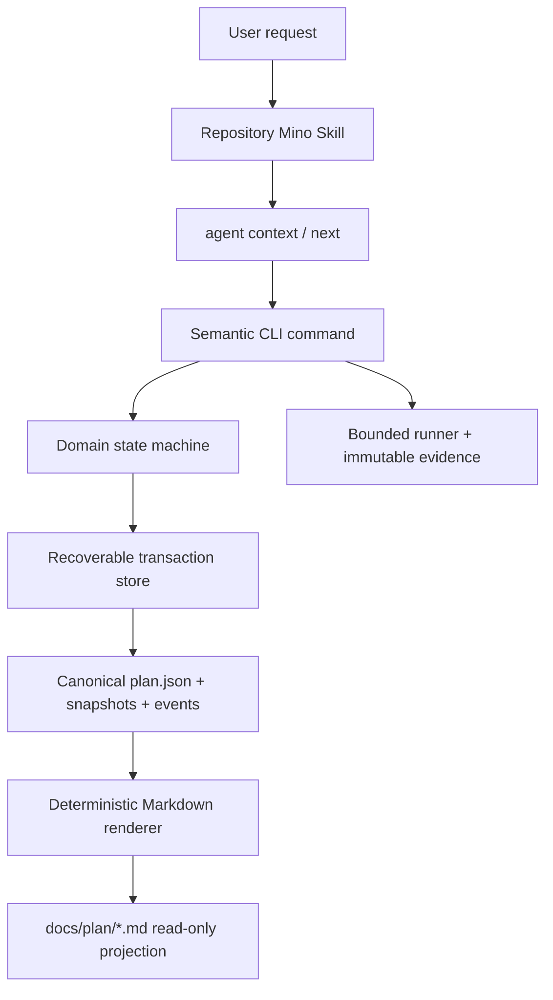
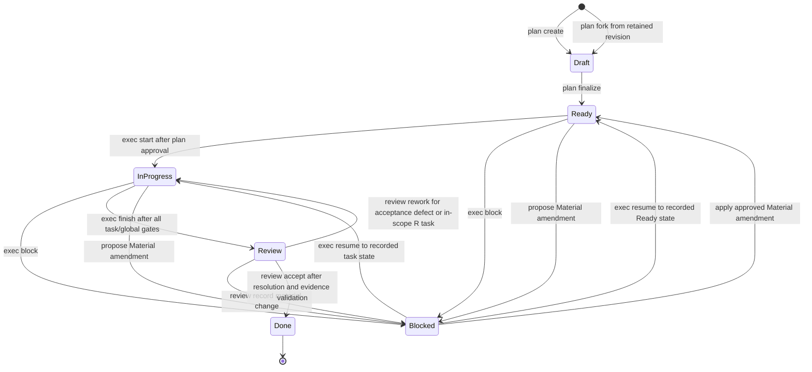

# Mino architecture

## Responsibility boundary

Mino separates probabilistic intent interpretation from deterministic protocol
enforcement. A coding agent interprets the request and chooses among legal
actions; Mino owns state, transitions, validation, execution evidence, and
rendering.



| Component | Owns | Does not own |
|---|---|---|
| Repository `AGENTS.md` | Stable trigger, repository hard rules, external tool/Git authorization | Dynamic plan state or full execution algorithm |
| Repository Mino Skill | Intent routing, CLI orchestration, approval stops | State transitions, direct managed-file edits, fallback templates |
| CLI/application services | Commands, concurrency checks, policy gates, evidence binding | Requirement interpretation or hidden approvals |
| Domain | Valid plan/task/check/criterion states, fork lineage, archive overlay, and legal transitions | Filesystem, process, network, or Git side effects |
| Git adapter and policy services | Read-only Git facts, worktree-local identity, one approval-gated branch create, and exact plan-scoped task commits | Remote, destructive, broad, or implicit Git mutation |
| `.mino/` | Machine-readable source of truth and immutable history | User-authored documentation |
| `docs/plan/*.md` | Human review projection | Source state or an editing surface |
| Standards engine | Embedded packages, recommendation, check resolution, explicit sync | General dependency installation |

## Project discovery and initialization

Read commands discover the root in this order:

1. `git rev-parse --show-toplevel` with terminal prompting disabled.
2. The nearest ancestor containing `.mino/`.
3. The nearest supported manifest (`Cargo.toml`, `package.json`,
   `pyproject.toml`, `setup.py`, `go.mod`, `pom.xml`, `build.gradle`, or
   `build.gradle.kts`).

`project init` permits a final fallback to the supplied directory. It verifies
the embedded protocol, creates missing `.mino` state, installs or verifies the
bundled repository Skill, and diagnoses integrations. It does not run network
or Git mutations. `AGENTS.md` and `.gitignore` change only when their explicit
apply flags are present and marker ownership is valid.

`project import legacy` is a two-phase adapter over the same plan service. It
first reads and parses the complete bounded source, previews the authored batch
against current Draft invariants, and records exact mappings and warnings. It
then creates a revision-one plan and applies the batch as revision two with a
derived idempotency UUID. Exact retry replays the immutable revision-one
snapshot and the authored mutation; an interrupted retry can complete the
second phase. The resulting aggregate is always Draft, while the legacy source
path, byte count, and SHA-256 are retained as provenance rather than trusted
execution state.

## Source-of-truth layout

```text
<root>/
├── .agents/skills/mino/                 tracked repository Skill
├── .mino/
│   ├── config.toml                      project format and optional catalog URL
│   ├── protocol.lock                    schema/protocol/renderer lock
│   ├── standards.local.toml             optional source-backed conflict declarations
│   ├── standards.lock                   selected standards and catalog generation
│   ├── active.json                      worktree-keyed active-plan bindings
│   ├── active.lock                      bounded active-binding writer lock
│   ├── git/
│   │   ├── branch.lock                  bounded branch-operation lock
│   │   ├── commit.lock                  bounded task-commit operation lock
│   │   ├── branches/<plan-id>/
│   │       ├── intent.json              immutable approval-bound branch intent
│   │       └── completion.json          immutable terminal branch result
│   │   └── commits/<plan-id>/<task-id>/
│   │       ├── intent.json              immutable pre-index content snapshot
│   │       ├── staged.json              immutable staged tree identity
│   │       └── completion.json          immutable commit/evidence/plan result
│   ├── cache/standards/                 verified immutable sync generations
│   └── plans/<plan-id>/
│       ├── plan.json                    current canonical aggregate
│       ├── events.jsonl                 append-only successful mutations
│       ├── snapshots/<revision>.json    immutable canonical revisions
│       ├── store.lock                   bounded advisory lock
│       ├── transaction/                 recoverable prepared transaction, if present
│       ├── runs/<request-id>/            immutable check lease and terminal result
│       └── evidence/
│           ├── index.jsonl              immutable evidence index
│           ├── records/                 canonical evidence records
│           └── blobs/                   content-addressed artifact bytes
└── docs/plan/<plan-id>.md                managed human projection
```

The managed `.gitignore` block excludes `/.mino/` and `/docs/plan/`. The
repository Skill is not ignored because it is intended to be reviewed and
tracked like other stable repository instructions.

### Owned path contract

| Path | Owner and edit policy |
|---|---|
| `.mino/config.toml` | Mino project configuration; change only through supported configuration workflows. |
| `.mino/protocol.lock` | Mino protocol lock; never hand-rewrite to claim compatibility. |
| `.mino/standards.local.toml` | Optional user-reviewed declarations that map rule values to safe project sources; Mino reads but does not generate it. |
| `.mino/standards.lock` | Mino standards lock; explicit sync may atomically replace it. |
| `.mino/active.json` | Versioned active-plan bindings; change only through `mino git bind`. |
| `.mino/active.lock` | Advisory binding lock; Mino owns its lifecycle and contents. |
| `.mino/git/branches/` | Immutable prepared/completed branch journals; manual editing is prohibited. |
| `.mino/git/commits/` | Immutable prepared/staged/completed task-commit journals; manual editing is prohibited. |
| `.mino/plans/` | Canonical plans, history, runs, and evidence; manual editing is prohibited. |
| `docs/plan/` | Generated Markdown projections; manual editing is prohibited. |
| `.agents/skills/mino/` | Stable bundled repository Skill; Mino updates only marker-owned bundle files. |
| `AGENTS.md` | User-owned except for the exact Mino workflow marker region. |
| `.gitignore` | User-owned except for the exact Mino runtime marker region. |

## Standards conflict precedence

The standards engine combines selected embedded package rules with optional
source-backed declarations in `.mino/standards.local.toml`. Each declaration
names a canonical project source or the plan's exact original request. Mino
hashes those bytes and orders competing values by current user requirement,
repository hard rule, formatter/linter/build/CI configuration, selected
language package, then Common.

Detection preserves every candidate; it does not concatenate or silently pick
values. `standards conflict refresh` records the exact candidate fingerprint in
the plan extension. `standards conflict resolve` records one candidate,
rationale, external decision reference, actor, timestamp, and that fingerprint.
Any source-byte or candidate-set change makes the prior decision stale and
blocks validation until refresh and a new explicit decision.

## Worktree-aware active-plan identity

`mino git inspect` runs a narrow read-only Git adapter without a shell and
parses NUL-delimited porcelain v2. It reports canonical worktree,
common-directory, worktree-specific Git directory, resolved index path, branch
or detached HEAD, upstream divergence, and sorted staged/unstaged/untracked
facts. Normal, unborn, detached, bare, linked-worktree, and non-repository
states remain explicit rather than being inferred from display text.

`mino git bind --plan <id> --current` publishes `.mino/active.json` under a
bounded lock and atomic replacement. A binding keys the canonical Git common
directory and canonical worktree root, then records either the branch name or
the exact detached HEAD. A branch binding remains current when that branch
advances; a detached binding requires the same commit. Switching branch or
leaving detached mode produces `stale_branch` or `stale_head`. An explicit bind
atomically replaces only the current worktree entry, which permits selecting a
later plan without changing another linked worktree's selection.

Agent context and active-plan lookup use only a `current` same-worktree
binding. `foreign_worktree`, stale, and non-repository states expose no active
plan. A bound plan must remain non-Done and non-archived. For compatibility,
absence of `active.json` retains the v0.1 single non-Done, non-archived plan
lookup; once the binding file exists, there is no cross-worktree fallback.

## Plan variants, comparison, and archive overlay

`mino plan fork` first audits the complete source event/snapshot chain and then
loads the exact requested retained revision. The canonical source snapshot hash
is stored with its plan ID, revision, reason, and timestamp as lineage in a new
revision-one Draft. Authored request, metadata other than current identity/time,
scope, decisions, standards, task definitions, planned checks, and commit intent
are copied. Lifecycle, blockers, current Git readiness, approval/amendment/review
records, evidence and terminal results, execution extensions, final outcome,
and archive state are reset. Source artifacts are never rewritten.

`mino plan diff` serializes both validated inputs into a normalized authored
view and walks it in stable key/ID order. The result classifies Added, Removed,
Changed, and Moved paths and carries both protocol headers; it never mutates or
merges plans. Fork lineage and archive state are intentionally excluded from
authored comparison.

Archive is an optional typed overlay on the aggregate, not another lifecycle
state. `mino plan archive` appends a reason, actor, explicit selection reference,
and timestamp while leaving Draft/Ready/In Progress/Blocked/Review/Done
unchanged. Archived plans remain fully readable and auditable but are excluded
from active selection and reject fresh mutations. Plan fork is unrelated to a
Git branch: `mino git branch create` still governs local ref creation, and no
plan merge operation exists.

## Approval-gated branch creation

`mino git branch propose --plan <id>` derives `mino/<plan-id>`, delegates final
name validation to Git, and reports all blockers without creating even Mino
journal state. Creation is separate and requires an explicit approval
reference. A clean current worktree must still match the plan's captured source
branch or detached mode and base commit, and the local target ref must be absent.

After policy succeeds under a bounded operation lock, Mino atomically publishes
an immutable intent containing the plan revision, canonical worktree identity,
exact base HEAD, branch name, and approval reference. It then runs one
hook-disabled `git switch -c` at the exact full base commit. Active binding and
an immutable completion record are published only after read-only inspection
confirms the expected branch, HEAD, and clean status. A retry can distinguish
unchanged source state, an already-applied switch awaiting binding, and a
completed operation, so it never creates the branch twice or silently cleans an
unexpected Git state.

## Recoverable task commits

`mino git commit --plan <id> --task <id>` is eligible only for the first Done
task whose required commit gate is not yet Committed. The plan must remain In
Progress with current approval and Approved Git Flow consent; the current
same-worktree binding, branch, HEAD parent, task evidence, File Map, Commit
Scope, and exact planned message must all match. The policy rejects any initial
index entry, unrelated or mixed change, rename, unmerged/submodule path,
symlink/directory, clean filter, Mino-owned path, or content drift.

After pure preflight, Mino captures bounded SHA-256 snapshots and atomically
publishes `intent.json` before touching the index. It stages only resolved exact
paths with `git add --`, confirms that no unstaged content remains, writes and
records the index tree, and invokes `git commit` with the exact one-line message.
Commit hooks remain enabled. The result is accepted only when one new commit has
the prepared parent/tree/message/files; immutable Commit evidence and the task
gate are recorded before terminal `completion.json` publication.

The three immutable phases make external mutation recoverable. A failed hook or
Git command leaves the prepared task paths staged and blocks the plan without a
reset or unstage. After `exec resume`, retry verifies the same staged tree. If
HEAD advanced before evidence, plan, or completion publication, retry inspects
the existing commit and completes those records without creating another
commit. A completed journal replays without Git or plan mutation.

## Optional advisory repository hooks

`mino git hook propose` and `status` inspect the canonical shared Git directory,
the default `hooks/pre-commit` and `hooks/post-commit` paths, any configured
`core.hooksPath`, ownership markers, and bounded file digests. The proposal hash
binds repository identity, target paths, ownership classes, conflict bytes, and
embedded template digests. Absent/current/Mino-owned-drifted paths form one
idempotent install class; user-owned, symbolic-link, non-file, or custom-path
states are non-installable and expose manual snippets.

`mino git hook install` is a separate approval boundary. After matching the
current proposal hash and external approval reference, it writes only the two
default hook files, repairs only marker-owned bytes, and verifies the result.
The installed LF shell templates are compatible with Git for Windows and Unix
Git, tolerate a missing/refusing Mino, and always remain advisory.
The tracked `.gitattributes` rule fixes only `assets/hooks/*` to `eol=lf`, so
template digests and shebang bytes survive Windows checkouts.

Hook invocation routes to `mino git hook run --hook pre-commit|post-commit`.
Runtime uses the existing read-only Git adapter with optional locks disabled and
the read-only active-binding resolver. It emits staged/HEAD observations,
binding diagnostics, and optional next commands; it does not load/mutate plans,
write events/evidence/bindings, stage files, create commits, or update hooks.

## Plan and task lifecycle



Finalization changes every Draft task to Ready. Only the first dependency-ready
task may start, every earlier required task commit must already be Committed,
and at most one task may be In Progress or Blocked. A task moves
to Done only after its planned checks, compatible criterion evidence, checkpoint
requirements, unresolved-deviation checks, and changed-file File Map gate pass.
`exec finish` requires every task Done, every required task commit gate
Committed, and all required global checks passed, then moves the plan to Review.
Archive is deliberately absent from the lifecycle diagram because it is a
non-destructive deactivation overlay rather than a status transition.

Review feedback is append-only and classified. Acceptance Defect reopens a Done
task only for fresh acceptance and verification evidence; any changed file is
rejected and must become In-Scope Rework. In-Scope Rework reserves a monotonic
`R<n>` identifier when feedback is recorded and materializes it only from a
complete task definition with dependencies, steps, File Map, criteria, checks,
and any required Git gate. Failed definitions do not release the reservation.
Follow-Up records remain outside task order. Material Change records move the
plan to a Review-owned Blocked state that generic `exec resume` cannot cross.
`review resolve` revalidates live evidence after rework, and approval-gated
`review accept` reaches Done only when every blocking item is resolved.

Protected amendments are top-level immutable audit records with contiguous
`C<n>` identifiers, typed operations, minimum/selected classification, exact
base revision and canonical state hash, computed impact, approval declaration,
and application timestamp. Only one proposal may be pending. Minor proposals
leave Ready/In Progress in place but block execution, evidence, and Git until
apply; Ready apply invalidates its plan approval. Material proposals own the
Blocked state until explicit approval and apply. Material apply preserves the
pre-change store snapshot, resets all task/check/commit gates to Ready/Pending,
clears execution checkpoints and plan approval/Git consent, marks referenced
evidence stale, supersedes affected review results, and requires full
validation/reapproval before execution can restart.

## Revision, event, and recovery model

Every semantic mutation supplies an expected revision and request UUID. Mino
holds a per-plan lock, verifies idempotency, prepares canonical next-state and
journal bytes, then publishes the snapshot, event, and current state. Loading a
plan first recovers a complete prepared transaction or reports corruption. An
exact retry returns the original result without another revision; reusing a
request UUID for different inputs is a revision conflict.

Markdown carries the plan ID, revision, state hash, renderer version, and a
manual-edit prohibition. Read and mutation services render the current plan and
compare exact projection bytes. Recognized prior bytes may be replaced during a
legitimate mutation; missing projections may be reconstructed from canonical
state; unrecognized edits produce exit 8 and are never silently overwritten.

## Execution and evidence flow

`exec check run` is a three-phase operation:

1. Commit a Running check lease to the plan.
2. Execute the exact planned argv without a shell under finite bounds, write an
   immutable run lease/result, redact output, and record immutable evidence.
3. Attach the evidence ID and terminal check status in a new plan revision.

An interrupted lease is recovered as an immutable interrupted result instead
of launching an ambiguous duplicate. Criterion and completion services accept
only compatible, current, non-superseded evidence. Failed command evidence
remains auditable but cannot prove a passing criterion.

`exec check monitor` is a finite foreground coordinator over that same
three-phase operation. Its required maximum-attempt, interval, and elapsed
deadline values allocate a deterministic timeout to every possible process:
the deadline minus all possible inter-attempt waits is divided by the attempt
count and capped at five minutes. The loop checks cancellation, deadline, and
attempt exhaustion before a new attempt and again after each failed attempt;
it never tails and creates no background service.

Attempt request IDs and expected revisions are deterministically derived from
the base request. Therefore an interrupted invocation can replay already
journaled attempts without launching duplicates and can run only the remaining
finite attempts. Pass, attempts exhausted, deadline reached, and cancellation
all produce a canonical request-hash-bound `mino.monitor/v1` record at
`.mino/plans/<plan-id>/monitors/<request-id>/summary.json`. Guarded regular
directories and no-clobber publication make the terminal record immutable;
an exact retry reads it before plan or evidence mutation.

## Version ownership

The v0.1 plan schema is `1`, renderer is `2`, and planning protocol is
`2026-05-11/review-rework-git-flow-v1`. Protocol template and execution-guide
bytes are inert embedded resources verified against their manifest digests.
They describe provenance; runtime behavior comes from the compiled domain and
application services.
