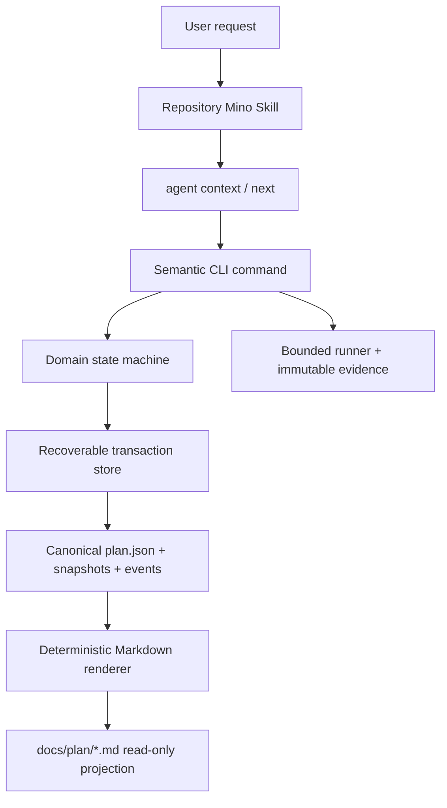
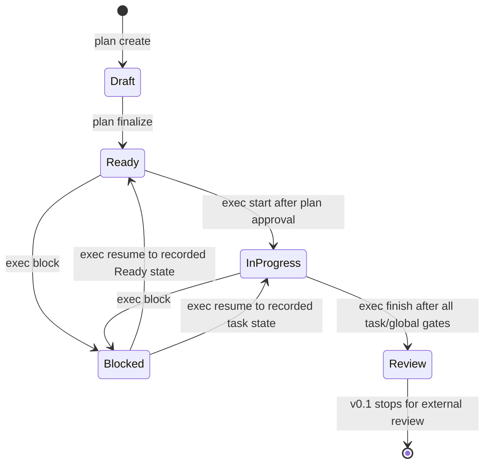

# Mino v0.1 architecture

## Responsibility boundary

Mino separates probabilistic intent interpretation from deterministic protocol
enforcement. A coding agent interprets the request and chooses among legal
actions; Mino owns state, transitions, validation, execution evidence, and
rendering.



| Component | Owns | Does not own |
|---|---|---|
| Repository `AGENTS.md` | Stable trigger, repository hard rules, external tool/Git authorization | Dynamic plan state or full execution algorithm |
| Repository Mino Skill | Intent routing, CLI orchestration, approval stops | State transitions, direct managed-file edits, fallback templates |
| CLI/application services | Commands, concurrency checks, policy gates, evidence binding | Requirement interpretation or hidden approvals |
| Domain | Valid plan/task/check/criterion states and legal transitions | Filesystem, process, network, or Git side effects |
| `.mino/` | Machine-readable source of truth and immutable history | User-authored documentation |
| `docs/plan/*.md` | Human review projection | Source state or an editing surface |
| Standards engine | Embedded packages, recommendation, check resolution, explicit sync | General dependency installation |

## Project discovery and initialization

Read commands discover the root in this order:

1. `git rev-parse --show-toplevel` with terminal prompting disabled.
2. The nearest ancestor containing `.mino/`.
3. The nearest supported manifest (`Cargo.toml`, `package.json`,
   `pyproject.toml`, `setup.py`, `go.mod`, `pom.xml`, `build.gradle`, or
   `build.gradle.kts`).

`project init` permits a final fallback to the supplied directory. It verifies
the embedded protocol, creates missing `.mino` state, installs or verifies the
bundled repository Skill, and diagnoses integrations. It does not run network
or Git mutations. `AGENTS.md` and `.gitignore` change only when their explicit
apply flags are present and marker ownership is valid.

## Source-of-truth layout

```text
<root>/
├── .agents/skills/mino/                 tracked repository Skill
├── .mino/
│   ├── config.toml                      project format and optional catalog URL
│   ├── protocol.lock                    schema/protocol/renderer lock
│   ├── standards.lock                   selected standards and catalog generation
│   ├── cache/standards/                 verified immutable sync generations
│   └── plans/<plan-id>/
│       ├── plan.json                    current canonical aggregate
│       ├── events.jsonl                 append-only successful mutations
│       ├── snapshots/<revision>.json    immutable canonical revisions
│       ├── store.lock                   bounded advisory lock
│       ├── transaction/                 recoverable prepared transaction, if present
│       ├── runs/<request-id>/            immutable check lease and terminal result
│       └── evidence/
│           ├── index.jsonl              immutable evidence index
│           ├── records/                 canonical evidence records
│           └── blobs/                   content-addressed artifact bytes
└── docs/plan/<plan-id>.md                managed human projection
```

The managed `.gitignore` block excludes `/.mino/` and `/docs/plan/`. The
repository Skill is not ignored because it is intended to be reviewed and
tracked like other stable repository instructions.

### Owned path contract

| Path | Owner and edit policy |
|---|---|
| `.mino/config.toml` | Mino project configuration; change only through supported configuration workflows. |
| `.mino/protocol.lock` | Mino protocol lock; never hand-rewrite to claim compatibility. |
| `.mino/standards.lock` | Mino standards lock; explicit sync may atomically replace it. |
| `.mino/plans/` | Canonical plans, history, runs, and evidence; manual editing is prohibited. |
| `docs/plan/` | Generated Markdown projections; manual editing is prohibited. |
| `.agents/skills/mino/` | Stable bundled repository Skill; Mino updates only marker-owned bundle files. |
| `AGENTS.md` | User-owned except for the exact Mino workflow marker region. |
| `.gitignore` | User-owned except for the exact Mino runtime marker region. |

## Plan and task lifecycle



Finalization changes every Draft task to Ready. Only the first dependency-ready
task may start, and at most one task may be In Progress or Blocked. A task moves
to Done only after its planned checks, compatible criterion evidence, checkpoint
requirements, unresolved-deviation checks, and changed-file File Map gate pass.
`exec finish` requires every task Done and all required global checks passed,
then moves the plan to Review.

The domain includes a `Done` state and review classifications for forward
schema compatibility, but v0.1 has no CLI transition from Review to Done and no
review/rework command group. Those commands are deliberately deferred.

## Revision, event, and recovery model

Every semantic mutation supplies an expected revision and request UUID. Mino
holds a per-plan lock, verifies idempotency, prepares canonical next-state and
journal bytes, then publishes the snapshot, event, and current state. Loading a
plan first recovers a complete prepared transaction or reports corruption. An
exact retry returns the original result without another revision; reusing a
request UUID for different inputs is a revision conflict.

Markdown carries the plan ID, revision, state hash, renderer version, and a
manual-edit prohibition. Read and mutation services render the current plan and
compare exact projection bytes. Recognized prior bytes may be replaced during a
legitimate mutation; missing projections may be reconstructed from canonical
state; unrecognized edits produce exit 8 and are never silently overwritten.

## Execution and evidence flow

`exec check run` is a three-phase operation:

1. Commit a Running check lease to the plan.
2. Execute the exact planned argv without a shell under finite bounds, write an
   immutable run lease/result, redact output, and record immutable evidence.
3. Attach the evidence ID and terminal check status in a new plan revision.

An interrupted lease is recovered as an immutable interrupted result instead
of launching an ambiguous duplicate. Criterion and completion services accept
only compatible, current, non-superseded evidence. Failed command evidence
remains auditable but cannot prove a passing criterion.

## Version ownership

The v0.1 plan schema is `1`, renderer is `2`, and planning protocol is
`2026-05-11/review-rework-git-flow-v1`. Protocol template and execution-guide
bytes are inert embedded resources verified against their manifest digests.
They describe provenance; runtime behavior comes from the compiled domain and
application services.
