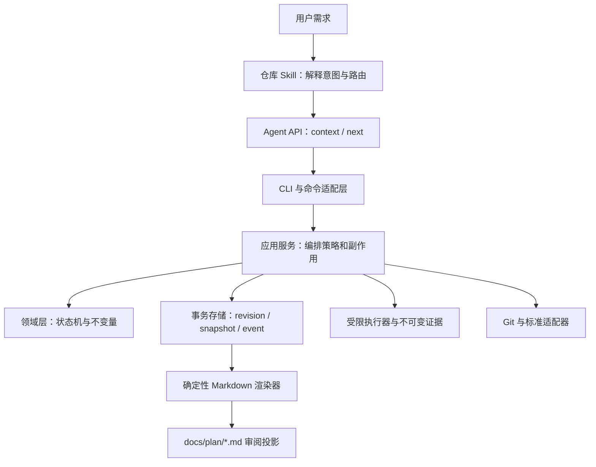
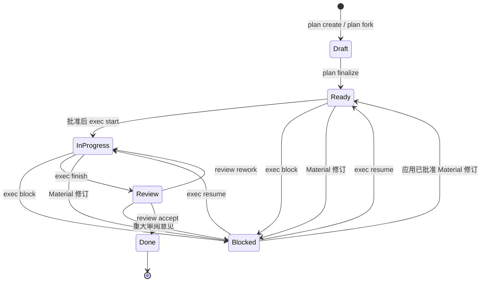

# Mino 架构

本文解释 Mino 的系统边界、状态所有权和恢复模型。命令参数与 JSON 字段请查阅[CLI 与 JSON 契约](command-contract.md)，具体风险处置请查阅[安全与操作边界](security.md)。

## 设计出发点

Mino 把“意图解释”和“协议执行”分开：编码代理可以用概率性推理理解需求，但所有状态转换、审批条件、执行顺序和证据绑定都由确定性代码决定。

这项分工带来四条架构原则：

1. **规范状态只有一个来源**：`.mino/` 中的 JSON、快照和事件是事实，Markdown 是投影。
2. **修改必须可并发校验和幂等重放**：每次语义修改绑定 revision 与 request ID。
3. **副作用必须有窄边界**：进程、Git、网络和文件写入分别由专门适配器约束。
4. **审批不可继承或猜测**：计划批准、分支创建、重大修订和最终验收等边界互不替代。

## 系统分层



| 层级 | 负责 | 不负责 |
|---|---|---|
| 仓库 `AGENTS.md` | 稳定触发规则、仓库硬约束、外部工具与 Git 授权 | 动态计划状态、完整执行算法 |
| Mino Skill | 意图路由、CLI 编排、识别审批停止点 | 改写规范状态、伪造模板或绕过 CLI |
| CLI 与 `commands` | 参数解析、命令分发、稳定输出格式 | 推断需求、隐藏审批 |
| `application` | 协调领域、存储、投影、执行和 Git 策略 | 定义新的领域状态 |
| `domain` | 计划、任务、检查、证据和审阅的合法状态及转换 | 文件系统、网络、进程和 Git 副作用 |
| `store` | 锁、规范序列化、事务恢复、快照和事件审计 | 业务意图判断 |
| `runner` / `evidence` | 有界进程、脱敏、运行日志和不可变证据 | 任意 shell 执行、替用户判断检查意义 |
| `git` | 只读事实、工作树身份、受控分支和精确任务提交 | 远程或破坏性 Git 操作 |
| `standards` | 内嵌规则、检测、推荐、冲突和显式同步 | 通用依赖安装或远程代码执行 |

## 项目发现与初始化

读取型命令按以下顺序寻找项目根：

1. 通过五秒、64 KiB 的统一 Git probe profile 运行 `git rev-parse --show-toplevel`。
2. 向上查找最近的 `.mino/`。
3. 向上查找最近的受支持清单：`Cargo.toml`、`package.json`、`pyproject.toml`、`setup.py`、`go.mod`、`pom.xml`、`build.gradle` 或 `build.gradle.kts`。

Git 明确报告非仓库时继续查找文件系统标记；Git 不可用、超时或输出异常时也允许已存在的 `.mino` 或清单成为确定性 fallback，但在没有任何文件系统证据时保留类型化 Git 失败。只有 `project init` 可以在以上规则均失败时使用调用方指定的目录。初始化会验证内嵌协议、创建缺失的 `.mino` 状态，并在分类 Skill、`AGENTS.md` 或 `.gitignore` 前恢复可证明安全的集成替换事务；除非显式提供 apply 参数，它不会发起新的 `AGENTS.md` 或 `.gitignore` 修改。初始化本身不执行网络或 Git 修改。

项目扫描通过串行且按路径排序的 `ignore::WalkBuilder` 读取根目录和嵌套 `.gitignore`、`.git/info/exclude` 以及 Git 全局 exclude；hidden filter 被关闭以保留 `.github` 等配置，符号链接不会被跟随。默认预算为最大深度 64、最多访问 100,000 个普通文件、总内容读取 128 MiB、单文件读取 4 MiB；内容读取使用固定 64 KiB 缓冲。预算触发后返回确定性的部分证据，并在 `bytes_read`、`truncated` 和排序后的 `truncation_reasons` 中显式说明，不把部分结果表示为完整扫描。

旧计划导入复用同一套计划服务，但采用两阶段写入：先读取完整且有界的源文件，预览可映射字段并产生警告；随后创建 revision 1 的 Draft，再以派生 request ID 写入 revision 2。中断后的精确重试可以补完第二阶段，历史状态、审批和证据不会被当作可信事实。

## 规范数据布局

```text
<root>/
├── .agents/skills/mino/                 可跟踪的仓库 Skill
├── .mino/
│   ├── config.toml                      项目格式与可选目录 URL
│   ├── protocol.lock                    协议、schema 与渲染器锁
│   ├── standards.local.toml             可选的本地标准来源声明
│   ├── standards.lock                   已选择标准与目录 generation
│   ├── active.json                      按工作树保存的活动计划绑定
│   ├── active.lock                      绑定写入锁
│   ├── integration-transactions.lock    集成替换全局锁
│   ├── integration-transactions/<hash>/ prepared/backed_up/published/cleaned 记录
│   ├── git/
│   │   ├── branch.lock                  分支操作锁
│   │   ├── commit.lock                  任务提交操作锁
│   │   ├── branches/<plan-id>/
│   │   │   ├── intent.json              审批绑定的不可变分支意图
│   │   │   └── completion.json          不可变终态结果
│   │   └── commits/<plan-id>/<task-id>/
│   │       ├── intent.json              写索引前的内容快照
│   │       ├── staged.json              已暂存 tree 身份
│   │       └── completion.json          提交、证据与计划结果
│   ├── cache/standards/                 已验证的不可变同步 generation
│   └── plans/<plan-id>/
│       ├── plan.json                    当前规范聚合
│       ├── events.jsonl                 追加式成功事件
│       ├── snapshots/<revision>.json    不可变 revision 快照
│       ├── store.lock                   有界计划锁
│       ├── transaction/                 尚待恢复的预备事务
│       ├── runs/<request-id>/            owner.lock、检查 lease 与结果
│       ├── monitors/<request-id>/summary.json
│       └── evidence/
│           ├── index.jsonl              不可变证据索引
│           ├── records/                 规范证据记录
│           └── blobs/                   按内容寻址的附件
└── docs/plan/<plan-id>.md                人工审阅投影
```

文档契约中使用的完整监控路径为 `.mino/plans/<plan-id>/monitors/<request-id>/summary.json`。

### 路径所有权

| 路径 | 所有者与修改方式 |
|---|---|
| `.mino/config.toml` | Mino 项目配置；只通过受支持的配置流程修改。 |
| `.mino/protocol.lock` | 协议锁；禁止手工改写以伪造兼容状态。 |
| `.mino/standards.local.toml` | 用户审阅的可选输入；Mino 读取但不生成。 |
| `.mino/standards.lock` | 标准选择锁；显式同步可以原子替换。 |
| `.mino/active.json` | 工作树绑定；只通过 `mino git bind` 修改。 |
| `.mino/integration-transactions/` | Skill 与 marker-owned 文件替换的规范恢复记录；只由 `project init` 恢复。 |
| `.mino/git/branches/` | 分支意图与完成日志；禁止手工编辑。 |
| `.mino/git/commits/` | 任务提交日志；禁止手工编辑。 |
| `.mino/plans/` | 计划、历史、运行与证据的规范存储；禁止手工编辑。 |
| `docs/plan/` | 自动生成的审阅投影；禁止手工编辑。 |
| `.agents/skills/mino/` | 稳定仓库 Skill；仅 marker-owned 文件可由 Mino 更新。 |
| `AGENTS.md` | 用户所有，只有精确的 Mino marker 区域受管。 |
| `.gitignore` | 用户所有，只有精确的 Mino runtime marker 区域受管。 |

受管 `.gitignore` 区块忽略 `/.mino/` 和 `/docs/plan/`。Skill 不被忽略，因为它需要像其他稳定仓库指令一样接受审阅和版本控制。

集成文件替换在目标父目录保存摘要绑定的 temporary/backup，并在 `.mino/integration-transactions/<target-hash>/` 追加不可变的 `prepared -> backed_up -> published -> cleaned` phase record。每个 phase 都绑定 target、backup、temporary、原摘要和替换摘要。`project init` 在任何集成分类前持锁恢复：prepared 可以回滚到原文件，backed_up 可以恢复原文件或继续发布，published 只清理摘要匹配的残留，cleaned 只移除事务记录。任何未知路径、非连续 phase、非规范 JSON 或摘要外字节都会保留并报错。`project doctor` 只读报告 pending/corrupt，不执行恢复。

## 计划生命周期



`plan finalize` 会把所有 Draft 任务转为 Ready。执行阶段只有第一个依赖满足的任务可以启动，并且任何更早的必需任务提交都必须已经记录。一个任务只有在以下门槛全部满足时才能进入 Done：

- 计划检查已通过；
- 每项验收条件绑定兼容且仍有效的证据；
- 必需检查点已记录；
- 没有未解决偏差；
- 实际变更符合 File Map。

`exec finish` 还要求所有任务提交门槛和全局检查完成，然后把计划送入 Review。归档不属于生命周期状态；它是保留全部历史的停用 overlay。

## 审阅、修订与方案分支

审阅记录是追加式的，并按行为分为四类：

- **Acceptance Defect**：重新打开已完成任务，只允许补充新的验收与检查证据，不允许改文件。
- **In-Scope Rework**：在记录反馈时预留递增 `R<n>`，提供完整任务定义后进入执行顺序。
- **Material Change**：把计划置为由审阅流程拥有的 Blocked，普通 `exec resume` 无法绕过。
- **Follow-Up**：记录为 Deferred，不进入当前任务顺序。

受保护修订使用递增 `C<n>` 和类型化操作。`Minor` 仅允许任务局部、不会改变用户可见行为的调整；`Material` 会清除计划批准和 Git Flow consent、重置任务与检查门槛、使相关证据失效，并要求重新校验与批准。

`plan fork` 从经过完整审计的历史快照创建独立 revision 1 Draft。它复制需求、范围、决策、标准、任务、检查和提交意图，但清除生命周期、审批、证据、审阅结果、执行扩展、Git 就绪状态及归档状态。lineage 保存来源计划、revision、原因、快照哈希和时间。

`plan diff` 只比较规范化后的 authored values，不修改或合并输入。`plan archive` 追加停用记录但不删除计划。计划 fork 与 Git branch 是两套独立概念，Mino 不提供 plan merge。

## Revision、事务与投影一致性

每项语义修改携带期望 revision、request UUID、actor、规范命令和变更字段。存储层在每个计划的有界锁内执行以下流程：

1. 检查 revision 与 request ID 幂等性。
2. 生成规范 next state、快照、事件和 write-ahead journal。
3. 依次发布不可变快照、追加式事件和当前 `plan.json`。
4. 返回包含 revision、事件序号和摘要的 receipt。

加载计划时会先完成可证明安全的预备事务，否则报告损坏。相同输入和 request ID 的重试返回原结果，不增加 revision；同一 request ID 携带不同输入则是 revision conflict。

Markdown 投影包含 plan ID、revision、状态哈希和 renderer version。读取与修改服务都会重新渲染并比较字节：缺失投影可以从规范状态恢复，已知旧投影可在合法修改中升级，无法识别的手工编辑会产生 exit 8，并保持原字节不被覆盖。

## 执行与证据

`exec check run` 是三阶段操作：

1. 在计划中提交 `Running` lease。
2. 以精确 argv、有限环境、超时和输出上限启动进程，保存运行结果并创建不可变证据。
3. 把证据 ID 和终态检查状态附加到新的计划 revision。

每个派生 run request ID 使用跨进程 `owner.lock`。owner 从发布 lease 前一直持有锁到 terminal result 完成文件与父目录同步；实时精确重试看到锁被占用时立即返回可重试的 AlreadyRunning，不写 result、evidence 或 plan 终态。只有调用方成功取得空闲 owner lock，并在锁内再次确认 lease 存在而 result 缺失，才能证明旧 owner 已退出并恢复不可变的 interrupted 结果。失败证据会保留用于审计，但不能证明验收通过；被 supersede 或被修订标记为 stale 的证据也不能满足当前门槛。

`exec check monitor` 复用同一检查流程，在前台执行有限重试。最大次数、间隔和总 deadline 一起决定每次进程预算；取消文件、deadline、通过或尝试耗尽都会产生 request-hash-bound 的 `mino.monitor/v1` 终态摘要。精确重试先读取摘要，不再睡眠或启动进程。

`exec schedule spec` 只读取并验证当前计划、同 revision 快照、投影和检查资格，然后生成 `mino.scheduled-task-spec/v1`。它描述执行环境、触发与过期时间、有限重试、结果策略和安全目标路径，但不调用调度器、不访问网络，也不写 Mino 状态。

## 工作树与 Git 边界

`mino git inspect` 通过唯一的生产 Git command adapter 执行窄范围命令，解析 NUL 分隔的 porcelain v2，并显式报告普通、unborn、detached、bare、linked worktree 和非仓库状态。项目发现、计划 readiness、File Map 检查、分支、提交与 hooks 共用该入口；其他生产模块不直接构造 Git 子进程。adapter 清空环境后恢复跨平台基础 allowlist，并按普通操作或短 probe profile 施加 stdin、timeout、合并输出与进程树边界。

`mino git bind` 以 canonical common directory 和 worktree root 为键保存活动计划。分支绑定允许该分支向前移动；detached 绑定要求完全相同的 HEAD。切换分支或 HEAD 后会变为 `stale_branch` 或 `stale_head`，其他工作树的绑定为 `foreign_worktree`。一旦 `active.json` 存在，就不再跨工作树回退选择计划。

分支和提交都使用不可变 intent → 外部操作 → completion 三段日志：

- `git branch create` 在单独批准后，只能从捕获的 base 创建并切换到确定名称 `mino/<plan-id>`；切换时禁用仓库 hooks。
- `git commit` 只处理第一个符合条件且要求提交的 Done 任务，要求当前审批、Approved Git Flow、相同工作树绑定、精确父 HEAD、有效证据，以及 File Map 与 Commit Scope 的交集路径。
- 提交前索引必须为空；Mino 只暂存解析后的精确路径，并保留正常 commit hooks。失败后不会 reset、unstage 或掩盖现场。

建议型 hooks 采用独立的 propose/status/install/run 流程。安装必须匹配当前 proposal hash，只能写默认的 marker-owned pre/post commit 路径；用户 hooks、符号链接和自定义 `core.hooksPath` 均保留。运行时仅输出 Git 与绑定观察，不写计划、证据、索引或 hook 文件。

## 标准冲突模型

标准引擎组合内嵌包和 `.mino/standards.local.toml` 中经用户审阅的来源声明。候选优先级固定为：

1. 当前用户要求；
2. 仓库硬规则或本地声明；
3. formatter、linter、build 或 CI 配置；
4. 语言包；
5. Common。

自动生成检查时，`SystemToolProbe` 与 Git adapter 复用同一 bounded command runner，但使用独立的三秒、64 KiB tool profile。probe 清空环境后只恢复跨平台工具链基础变量，关闭 stdin，并在异常时终止进程树。`ToolProbe` 返回类型化 outcome；标准应用保留 unresolved check 及精确原因，因此工具 shim 不会无限阻塞计划创建，也不会把 timeout 或输出洪泛压缩成普通“未安装”。

检测会保留全部候选，不拼接也不静默选择。`standards conflict refresh` 把当前候选指纹记录进计划，`resolve` 则保存选择、理由、外部决策引用、actor 与时间。任一来源字节变化都会使旧决定失效，直到再次 refresh 并显式选择。

## 版本所有权

当前 plan schema 为 `1`，renderer 为 `2`，planning protocol 为 `2026-05-11/review-rework-git-flow-v1`。协议模板和执行指南作为经过 manifest 摘要验证的惰性资源内嵌；它们说明来源和交互方式，真正的运行时约束来自编译后的领域与应用服务。
