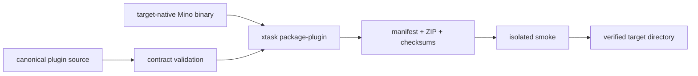

# 原生 Codex 插件分发

Mino 的 canonical 插件源码位于 `plugins/mino/`。源码目录本身不是可安装的原生产物：打包流程会为目标平台加入且只加入一个 `bin/mino` 或 `bin/mino.exe`，并把完整来源、兼容身份和文件摘要写入可验证 ZIP。

仓库负责构建与验证，不自动上传、发布、安装、更新或注册 marketplace entry。所有分发和安装都是独立的外部动作。

## 从源码到产物



流程只支持 host-native packaging：负责打包的操作系统与架构必须和声明 target 相符，不进行交叉打包后伪装验证。

## Canonical source 与兼容身份

`plugins/mino/` 包含：

- `.codex-plugin/plugin.json`；
- `launcher.json`；
- 面向维护者的 README；
- 与 `assets/skill/mino` 逐字节一致的 Skill tree。

canonical source 不包含 binary。Rust contract 在打包前核对：

- Cargo 与 plugin semantic version；
- protocol version、revision、schema 和 renderer；
- Agent capabilities/context/next schema 与 capabilities digest；
- 内嵌 standards package versions；
- Skill bytes 与 source inventory；
- 支持的 target、binary name 和 relative layout；
- capabilities、doctor、context 三类 non-interactive probes；
- offline、PATH 不变与 incompatible binary 的 exit 7 行为。

任一 version、protocol、capability、standard、Skill、manifest、target、path、file type 或 unexpected content 漂移都会在生成 artifact 前失败。bundle 不会回退使用环境中的其他 `mino`，也不会下载替代 binary。

## 构建一个目标产物

先构建当前平台的 release binary，再调用 maintainer xtask：

```text
cargo build --release --locked --bin mino
cargo run --release --locked --bin xtask -- package-plugin \
  --repository . \
  --binary target/release/mino \
  --target x86_64-unknown-linux-gnu \
  --output dist
```

Windows 使用 `target/release/mino.exe` 与 `x86_64-pc-windows-msvc`。

声明支持五个原生 target：

- `x86_64-pc-windows-msvc`
- `x86_64-unknown-linux-gnu`
- `aarch64-unknown-linux-gnu`
- `x86_64-apple-darwin`
- `aarch64-apple-darwin`

`.github/workflows/release-artifacts.yml` 为每个 target 分配原生 runner，执行 locked dependency fetch、source contract test、release build、artifact assembly 和 isolated smoke。workflow 只有 repository read permission，不含 upload、release、publish、secret 或 marketplace step。

## 产物结构与可复现性

每个 target 目录恰好包含三个文件：

```text
dist/<target>/
├── SHA256SUMS
├── artifact-manifest.json
└── mino-plugin-<version>-<target>.zip
```

ZIP 内是一棵完整 `mino/` plugin tree，包括 canonical source、MIT 与 Apache-2.0 license，以及一个目标平台 binary。为了获得可复现字节：

- entry 按 path 排序；
- 使用 store 模式，不做 compression；
- timestamp 固定为 ZIP epoch；
- data mode 统一为 `0644`，binary mode 为 `0755`；
- manifest 记录每个 path、byte count、mode 与 SHA-256；
- archive、source、Skill、protocol、standards、target 和 capabilities identity 一并绑定。

manifest schema 为 `mino.plugin-artifact-manifest/v1`。

相同输入生成相同 archive 与 manifest digest。现有 target directory 只有在全部内容相同时才会复用；任何 mismatch 都不会被覆盖。

## 验证产物

交付或安装前至少执行以下核对：

1. 验证 `SHA256SUMS`；
2. 解析 canonical `mino.plugin-artifact-manifest/v1`；
3. 确认 target 和 archive name 与预期一致；
4. 核对 archive inventory、entry mode、timestamp 和 digest；
5. 运行隔离 smoke probes。

xtask 会拒绝 absolute、parent、duplicate、unsorted、symlink、special、missing、extra、changed、compressed、timestamp-drifted、mode-drifted 或 digest-drifted entry。

## 隔离冒烟与安装边界

xtask 在发布本地 output 前，把已验证 ZIP 解压到临时 installation，并从 archive 内的绝对 binary path 运行四个有限 probe：

```text
mino --version
mino agent capabilities
mino project doctor
mino agent context
```

smoke 将 HOME、USERPROFILE 与临时目录指向隔离 root。host PATH 只原样传递，以便只读 Git discovery 工作；流程不会修改 PATH，也不会按 PATH 搜索另一个 Mino。smoke 不联网，不创建用户安装或 marketplace state。

安装是打包之外、需要用户授权的操作。验证 target artifact 后，应使用当前 Codex 环境支持的安装机制，把完整 `mino/` 目录作为一个 plugin root 解压，保持以下内容在一起：

- `.codex-plugin/plugin.json`
- `launcher.json`
- `skills/`
- licenses 与 README
- `bin/`

Skill 只解析 launcher 声明的相对 binary。先运行 capabilities probe，再运行 doctor 或计划工作。如果 binary 缺失、平台不符、不是普通文件或能力身份不兼容，应以 `environment_unavailable` / exit 7 停止；不要修改 PATH、下载替代品或混合不同 artifact 的文件。

## 升级、回滚与发布责任

<!-- doc-contract: upgrade-rollback-publication -->

Cargo package version 是 plugin version 的权威来源。升级必须把 canonical source 与 native binary 作为一个整体变更：

1. 更新 source 与版本；
2. 为全部 target 重新构建；
3. 重跑 contract 与 compatibility probes；
4. 生成新的 manifests 与 checksums；
5. 以完整 bundle 替换旧版本。

不要单独替换既有 bundle 中的 Skill、launcher 或 binary。为回滚保留上一个经过验证的完整 artifact，并以整个 target bundle 为单位恢复。

安装 plugin 不授权修改项目 `.mino` 状态。项目协议兼容仍由 `mino protocol status` 与 `mino protocol migrate` 管理。

artifact workflow 只做验证。上传文件、创建 release、发布 marketplace entry 或更改用户 installation 都需要额外工具和明确授权。

## 明确不做什么

<!-- doc-contract: deliberate-non-goals -->

该插件不是任意 plugin runtime、package manager、updater、downloader、daemon、cloud service、Web UI 或执行 sandbox。它只贡献一份声明式 Skill 和一个原生 Mino binary，不增加 MCP server、App、telemetry、auto-update 或隐藏 Git/network 行为。
