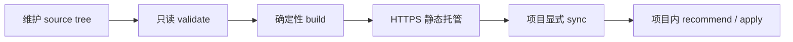

# 团队标准目录

Mino 可以把一组经过审阅的 TOML 标准包构建成静态、可复现、摘要校验的团队目录。目录只分发数据，不是插件 runtime：其中只能包含 package manifest、rules、checks 和生成的 index metadata。

项目仍通过显式的 `mino standards sync --all` 消费目录。同步只负责下载、验证和锁定，不会自动启用所有团队规则。

## 适用场景与边界

团队目录适合统一可审阅的代码规范和验证命令，同时让每个项目保留明确选择与冲突处理。它不适合分发脚本、二进制、依赖安装器或任意扩展代码。

完整流程分成四个独立阶段：



build、host、sync 和 apply 不互相授权，也不会被合并成隐式操作。

## Source tree 契约

source root 只能包含 `catalog-source.toml` 与 `packages/`。根配置声明：

- `source_version = 1`；
- 小写 DNS-like namespace；
- canonical HTTPS base URL。

每个直接 package 目录必须且只能包含：

```text
manifest.toml
rules.toml
checks.toml
```

package ID 必须属于 namespace，例如 `engineering.example.common` 或 `engineering.example.rust`；version 必须是 canonical SemVer。rule/check ID 必须归属于对应 package，路径必须是普通 UTF-8 relative path，所有文档必须非空且满足大小上限。

以下内容会被拒绝：symlink、executable source、special file、duplicate identity、unknown field、escaping path 和超限数据。

## 创建与维护 source

用惰性示例初始化目录：

```text
mino standards catalog init \
  --source team-standards \
  --namespace engineering.example \
  --base-url https://standards.example.com/mino \
  --format json --no-input
```

`init` 不覆盖现有目标。生成的 package 只展示格式，在分发前应由团队用经过审阅的组织策略替换。

建议把 source tree 当作普通代码审阅对象：规则变化使用新的 SemVer，提交中说明兼容影响，并在 build 前运行只读验证。

## 验证与构建

### 只读验证

```text
mino standards catalog validate \
  --source team-standards \
  --format json --no-input
```

validate 检查路径、namespace ownership、SemVer、TOML schema、identity 唯一性、文件类型和大小，不写 source 或 output。

### 生成静态目录

```text
mino standards catalog build \
  --source team-standards \
  --output dist/team-standards \
  --format json --no-input
```

builder 会规范化 TOML 与 LF 换行，稳定排序所有 identity，计算 package 和 tree SHA-256，在临时位置完成全部验证后再原子发布。

```text
dist/team-standards/
├── catalog.toml
├── catalog-manifest.json
└── packages/
    └── <package>/
        ├── manifest.toml
        ├── rules.toml
        └── checks.toml
```

- `catalog.toml` 是现有 Mino sync 读取的兼容接口。
- `catalog-manifest.json` 是操作证据，记录 source、file、package、catalog 和 tree 的精确身份。

相同 canonical source 重复构建会得到相同字节和摘要。build 只能替换已经通过完整 Mino catalog verification 的旧 output；损坏目录或无关目录会被保留并拒绝覆盖。

## 托管与版本策略

把生成目录作为 immutable static files 部署到 source 声明的精确 HTTPS base URL。不要在线编辑已发布文件。规则变化时：

1. 更新 source 中的 package version；
2. 重新 validate 和 build；
3. 发布新的完整静态树；
4. 保留旧版本字节，供仍引用旧 lock 的项目使用。

目录服务器不需要执行 Mino 专用代码，只需要按原路径返回固定字节。

## 项目同步与应用

项目先在 `.mino/config.toml` 配置 catalog URL，再显式执行唯一的目录网络操作：

```text
mino standards sync --all --format json --no-input
```

生产 CLI 要求 HTTPS、禁用 redirect，并限制总耗时、单文件和总下载大小。所有 package digest 通过后，Mino 写入新的 immutable cache generation，最后才更新 `.mino/standards.lock`。相同且已验证的 generation 会复用；loopback HTTP 只用于确定性 library tests。

sync 与 apply 刻意分离：

- sync 下载、缓存并锁定目录中的全部 packages；
- sync 不会把全部 package 或语言自动加入项目；
- 当前 `standards recommend` 与 `standards apply --recommended --seed-verification` 继续根据内嵌 project/language recommendations 解析规则；
- 当前 CLI 不提供 remote-package selection flag。

因此，团队目录提供的是安全的 authoring 与完整 sync compatibility，不会静默扩大既有项目的 active rule set。

如果用户要求、仓库规则、项目配置、语言包或 Common 给出冲突值，application 仍会停止。必须使用正常的 `standards conflict` 流程刷新候选，并在独立审批边界中选择当前值。

## 信任与恢复

<!-- doc-contract: trust-and-recovery -->

信任在每层都显式建立：

- catalog author 负责 source review 与 HTTPS hosting；
- namespace 和 SemVer 表示策略身份，SHA-256 表示精确字节；
- 下载内容在 document schema 与 aggregate digest 全部通过前不可信；
- download、parse、limit、digest 或 publication 失败会保留此前 active cache 与 lock；
- source bytes 改变后，旧 standards-conflict decision 会失效，直到 refresh 并重新选择。

恢复时，优先恢复最后一个已验证的静态树；如果 source 本身有误，则修正后发布新 version。随后重新运行 `standards sync --all`。不要手工修补 cache 文件或 `.mino/standards.lock`。

## 明确不做什么

<!-- doc-contract: deliberate-non-goals -->

团队目录不会执行任意代码、自动发现 packages、推断信任、合并冲突规则、推送更新、轮询服务器、自动更新项目或提供托管 registry。Mino 没有 catalog daemon 或后台 refresh；网络只发生在用户显式 sync 时。
